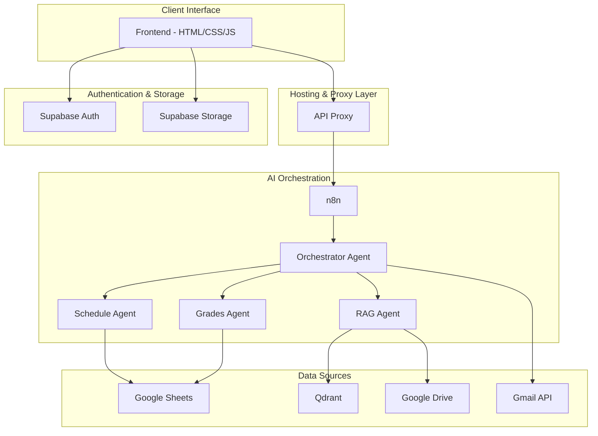

# 🚀 EstiNova — Academic Portal & AI Assistant (ERP)

### 🏫 ESTIN — National Higher School of Computer Science

### 📍 Amizour, Béjaïa, Algeria • Academic Year 2025/2026

**A next-generation academic management platform powered by Artificial Intelligence**

---

# 📖 Overview

**EstiNova** is a modern academic management platform designed for ESTIN Béjaïa. It centralizes schedules, examination results, academic resources, and administrative services within a unified and intelligent platform.

Powered by Artificial Intelligence, EstiNova enables students, professors, and administrators to interact naturally with institutional data through an AI assistant capable of understanding context, retrieving information, and automating academic workflows.

The platform aims to modernize academic management while ensuring security, scalability, and complete data sovereignty.

---

# 💬 Dynamic Chat Interface & Role-Based Workflows

Once authenticated on the EstiNova portal, users interact directly with the AI assistant and actively choose the workflow corresponding to their role.

Supported workflows:

* 🎓 Student
* 👨‍🏫 Professor
* 🏛️ Administrator

The workflow selector is integrated directly inside the chat interface and determines which AI pipeline receives the request.

This mechanism provides:

* 🎯 Context-aware responses
* 🔒 Strong access control
* ⚡ Workflow specialization
* 👤 Personalized user experiences

---

# 🏗️ System Architecture & Communication Flow

EstiNova is built upon a modular and decoupled architecture where the Frontend acts as the secure intermediary between users, authentication services, and AI orchestration workflows.

## 📐 Architecture Diagram

---

# 🔗 Connection Workflow

## 1️⃣ User Authentication

The user authenticates using their institutional account through Supabase Authentication.

After validation, a secure session is generated and stored.

---

## 2️⃣ Frontend Context Injection

The frontend retrieves user information and session data including:

* First Name
* Last Name
* Email
* Role
* Promotion
* Section
* Group

This information is attached to every AI request.

---

## 3️⃣ API Proxy

All requests pass through a secure API Proxy hosted on Vercel.

Responsibilities:

* Hide internal endpoints
* Protect workflow URLs
* Filter malicious requests
* Apply SSRF protection

---

## 4️⃣ AI Processing

Validated requests are forwarded to n8n where AI orchestration begins.

The Orchestrator Agent determines which specialized workflow should process the request.

---

# 🔐 Authentication & Access Control

EstiNova implements a dual-layer authentication architecture based on a defense-in-depth security model.

---

## Layer 1 — Supabase Authentication

The first security layer is managed by Supabase Authentication.

Users sign in using their institutional email account.

Supabase handles:

* User authentication
* Session creation
* Token management
* User identity verification
* Session restoration

### Silent Authentication

To improve user experience, EstiNova implements Silent Authentication.

When a user revisits the platform:

1. Supabase automatically restores the session.
2. Credentials are verified in the background.
3. User information is retrieved automatically.
4. Access is granted instantly.

Benefits:

* ⚡ Faster access
* 🔒 Secure session restoration
* 👤 Personalized experience
* 🚀 Seamless navigation

---

## Layer 2 — n8n Authentication & Authorization

A second authentication layer is implemented directly inside n8n workflows.

Possessing a valid Supabase session alone does not grant access to AI services.

Before executing any workflow:

1. The Frontend sends authenticated user information.
2. n8n validates the received identity.
3. Academic records are verified.
4. Role permissions are checked.
5. Workflow authorization is evaluated.

This additional layer ensures that only authorized users can access protected resources.

### Security Checks

n8n verifies:

* Email existence
* Academic profile
* User role
* Promotion
* Section
* Group
* Workflow permissions

Unauthorized requests are immediately rejected.

---

## 🛡️ Security Auditing

Every unauthorized access attempt is automatically logged.

The audit system records:

* Timestamp
* Attempted email
* Session identifier
* Detected role
* Event type

This allows:

* Security monitoring
* Activity tracking
* Incident investigation
* Access auditing

---

## 🎯 Role-Based Access Control (RBAC)

Supported roles:

* 🎓 Student
* 👨‍🏫 Professor
* 🏛️ Administrator

Each role is connected to dedicated workflows and authorized tools.

This prevents:

* Unauthorized access
* Privilege escalation
* Data leakage
* Workflow abuse

---

# 📂 Why Google Workspace & Google Sheets?

EstiNova integrates Google Workspace services as operational databases.

The institution already relies heavily on Google Workspace for academic management.

Using Google Sheets offers:

* Familiar environment
* Easy collaboration
* Rapid updates
* Minimal training requirements
* Low operational cost

The platform synchronizes academic data directly with Google Workspace services.

---

# 📚 Retrieval-Augmented Generation (RAG)

To provide reliable answers regarding regulations, procedures, and academic policies, EstiNova implements a complete RAG pipeline.

## 1️⃣ Data Ingestion

Official documents including:

* PDFs
* Academic regulations
* Administrative procedures
* Internal guidelines

are processed and indexed.

---

## 2️⃣ Embedding Generation

Documents are:

1. Split into chunks
2. Converted into embeddings
3. Stored inside Qdrant

---

## 3️⃣ Semantic Retrieval

When a question is asked, the platform performs semantic search to retrieve the most relevant information.

---

## 4️⃣ Context-Enriched Generation

Retrieved context is injected into the prompt before generation.

Benefits:

* Reduced hallucinations
* Higher accuracy
* Traceable responses
* Official information grounding

---

# 📊 System Design & Modeling

## 🎯 Use Case Diagram

Illustrates interactions between:

* Students
* Professors
* Administrators
* AI Assistant

---

## 🔄 Sequence Diagram

Represents communication between:

Frontend → API Proxy → n8n → Data Sources

---

## 🧩 UML Class Diagram

Describes:

* Users
* Profiles
* Academic entities
* Relationships

---

## 🗄️ Database Schema

Supabase stores:

* User accounts
* Profiles
* Metadata
* Academic references

---

# ☸️ Hosting, Sovereignty & Offline Operation

To guarantee privacy and institutional sovereignty, EstiNova follows a self-hosted architecture.

---

## ☸️ Kubernetes (K8s) Infrastructure

All services are orchestrated using Kubernetes.

Managed workloads include:

* Frontend
* API Proxy
* n8n
* Qdrant
* Local LLM Services
* Monitoring Services

Advantages:

* High availability
* Self-healing deployments
* Horizontal scalability
* Centralized management
* Production-grade reliability

---

## 🌐 ngrok Exposure

During development and testing phases, ngrok tunnels securely expose local services and webhooks.

---

## 🏢 On-Premise Deployment

Production deployment is performed directly on ESTIN infrastructure.

This ensures:

* Full control over infrastructure
* Institutional sovereignty
* Regulatory compliance

---

## 🤖 Local AI Models

Local Large Language Models can operate entirely on ESTIN infrastructure.

Benefits:

* No dependency on external providers
* Maximum privacy
* Full control over data

---

## ✅ Validation & Testing

Extensive testing demonstrated:

* Low latency
* High resilience
* Stable orchestration
* Reliable retrieval quality
* Secure authentication workflows

---

# 🛠️ Technology Stack

| Component           | Technology                            | Purpose                          |
| ------------------- | ------------------------------------- | -------------------------------- |
| 🎨 Frontend         | HTML, CSS, Vite, TypeScript           | Modern responsive interface      |
| 🔐 Authentication   | Supabase Auth (Silent Authentication) | Session and identity management  |
| 🗂️ Storage         | Supabase Storage                      | Avatar and file storage          |
| 🔄 API Proxy        | Vercel Serverless Functions           | Secure request forwarding        |
| 🧠 AI Orchestration | n8n                                   | Agents, workflows and routing    |
| 🤖 LLM Models       | Local LLM / Gemini 2.0                | AI reasoning and generation      |
| 📚 RAG              | HuggingFace Embeddings + Qdrant       | Semantic retrieval               |
| ☸️ Infrastructure   | Kubernetes (K8s)                      | Container orchestration          |
| 📦 Containerization | Docker                                | Application packaging            |
| 📊 Academic Data    | Google Sheets                         | Schedules, grades and structures |
| 📁 Documents        | Google Drive                          | Academic resources               |
| 📧 Communication    | Gmail API                             | Notifications and automation     |

---

# 🔐 Security & Best Practices

### 🛡️ Defense-in-Depth Security

Authentication is enforced at multiple layers:

* Supabase Authentication
* n8n Authorization
* Workflow Validation
* RBAC Enforcement

---

### 🚫 SSRF Protection

The API Proxy blocks requests targeting:

* localhost
* 127.0.0.1
* Private network ranges

---

### 🔑 Zero Secret Commit Policy

Secrets are:

* Stored in deployment environments
* Never committed to Git repositories
* Excluded through `.gitignore`

---

# 👨‍💻 Team

* **Boudjaoui Badis** — Project Manager, AI Engineer & Back-End Developer
* **Chiheb Israa** — AI Engineer & Front-End Developer

> Special thanks to Chiheb Israa for her professionalism and valuable contribution throughout the development of the project.

---

# ⭐ EstiNova

### Reimagining Academic Management Through Artificial Intelligence

Built for ESTIN

